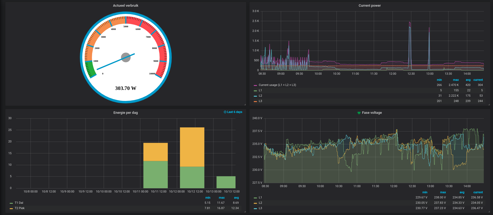

# P1 Smartmeter
Read information from the P1 port on a smartmeter and publish it on a MQTT (Mosquitto) topic.

The code is primarly written for a Sagemcom CS 50001 smartmeter, but should be compatible with more (all) smartmeters. The Sagemcom CS 50001 uses the DSMR5/ESMR5 P1 standard, for more information about this standard, see the 
[DSMR 5.0.2 P1 Companion Standard](https://www.netbeheernederland.nl/_upload/Files/Slimme_meter_15_a727fce1f1.pdf)

## Installation and configuration
This (python) code uses some libraries that need to be installed. Assuming you are using a Raspberry Pi or another Debian based Linux distribution, the following command's will install the dependencies

```lang=shell
$ sudo apt-get install python3-serial python3-pip python3-yaml
$ sudo pip3 install paho-mqtt
````

After installing the dependencies, clone this repository and modify the configuration file p1_smartmeter.yaml and run `sudo make install`.

```lang=shell
$ git clone https://github.com/Mosibi/p1-smartmeter.git
$ vi p1_smartmeter.yaml
$ sudo make install
```

If your smartmeter is also DSMR5/ESMR5 based, the changes to the configuration file should be minimal. Probably you only have to change the `mqtt_username`, `mqtt_password` and `mqtt_host` settings.

## Advanced configuration
The configuration file uses the yaml syntax, mostly the setting names will be self-explanatory, but some need some more explanation.

**debug**  
Set this to True of False. When is set to True, it will spit out at lot(!) of debugging information. If you want to see all the data your smartmeter can deliver, run it with True for a minute. Use `sudo journalctl -f -u p1-smartmeter.service` to see the output.

**mqtt_topic_base**  
This setting defines the base for every MQTT message. This will be joined with the `mqtt_topic` setting that's defined for an OBIS id (Object Identification System)

**obis**  
For every OBIS id (Object Identification System), your smartmeter has data for, there should be an entry in that hash. An OBIS reference support the following:

| Setting     | Description                                                                                                         | Data type              |
| ----------- | ------------------------------------------------------------------------------------------------------------------- | ---------------------- |
| description | Description of the OBIS id.                                                                                         | string                 |
| publish     | Should this OBIS published on MQTT.                                                                                 | boolean, True or False |
| average     | The number of measurements that shoud be averaged before publishing it on MQTT. Can't be used together with `count` | integer                |
| count       | After this number of measurements the value is published on MQTT. Can't be used together with `average`             | integer                |
| mqtt_topic  | The MQTT topic where this value is published on. The string will be joined with the `mqtt_topic_base` setting       | string                 |


## Integration with Home-Assistant
In my setup I sent all the smartmeter data to the MQTT server I have installed within Hassio. Within Home-Assistant, I've configured sensors that are pointing to the several MQTT topics. My configuration.yaml contains an include statement to `includes/sensors.yaml`, where I define the several sensor.

**configuration.yaml**
```lang=yaml
sensor: !include includes/sensor.yaml
```

**includes/sensors.yaml**
```lang=yaml
- platform: mqtt
  state_topic: "house/0/hallway/smartmeter/current_power_used_watt"
  name: "Current Power"
  qos: 0
  unit_of_measurement: "Watt"
- platform: mqtt
  state_topic: "house/0/hallway/smartmeter/l1_current_power_used_watt"
  name: "Current Power L1"
  qos: 0
  unit_of_measurement: "Watt"
- platform: mqtt
  state_topic: "house/0/hallway/smartmeter/l2_current_power_used_watt"
  name: "Current Power L2"
  qos: 0
  unit_of_measurement: "Watt"
- platform: mqtt
  state_topic: "house/0/hallway/smartmeter/l3_current_power_used_watt"
  name: "Current Power L3"
  qos: 0
  unit_of_measurement: "Watt"
- platform: mqtt
  state_topic: "house/0/hallway/smartmeter/t1_used_kWh"
  name: "Energy T1"
  qos: 0
  unit_of_measurement: "Watt"
- platform: mqtt
  state_topic: "house/0/hallway/smartmeter/t2_used_kWh"
  name: "Energy T2"
  qos: 0
  unit_of_measurement: "Watt"
- platform: mqtt
  state_topic: "house/0/hallway/smartmeter/gasmeter"
  name: "Energy Gas"
  qos: 0
  unit_of_measurement: "m3"
- platform: mqtt
  state_topic: "house/0/hallway/smartmeter/l1_voltage"
  name: "L1 Voltage"
  qos: 0
  unit_of_measurement: "Volt"
- platform: mqtt
  state_topic: "house/0/hallway/smartmeter/l2_voltage"
  name: "L2 Voltage"
  qos: 0
  unit_of_measurement: "Volt"
- platform: mqtt
  state_topic: "house/0/hallway/smartmeter/l3_voltage"
  name: "L3 Voltage"
  qos: 0
  unit_of_measurement: "Volt"
- platform: mqtt
  state_topic: "house/0/hallway/smartmeter/l1_amperage"
  name: "L1 Amerage"
  qos: 0
  unit_of_measurement: "Amp"
- platform: mqtt
  state_topic: "house/0/hallway/smartmeter/l2_amperage"
  name: "L2 Amerage"
  qos: 0
  unit_of_measurement: "Amp"
- platform: mqtt
  state_topic: "house/0/hallway/smartmeter/l3_amperage"
  name: "L3 Amerage"
  qos: 0
  unit_of_measurement: "Amp"
  ```


## Integration with Grafana
I configured Home-Assistant to sent its data to InfluxDB and Grafana uses InfluxDB as a backend. To get the dashboard (see below), I am using, import [grafana.json](src/grafana.json) in Grafana. The gauge needs [D3 Gauge](https://github.com/briangann/grafana-gauge-panel)




